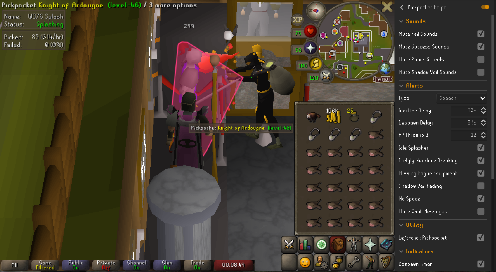

# Pickpocket Helper
Adds quality of life improvements for pickpocketing.
## Features
Currently, the plugin offers the following improvements:
<ol>
<li><a href="#sounds">Sounds</a></li>
<li><a href="#sounds">Alerts</a></li>
<li><a href="#sounds">Utility</a></li>
<li><a href="#sounds">Indicators</a></li>
<li><a href="#sounds">Overlays</a></li>
</ol>

### Sounds

Offers the ability to mute specific game sounds, most of which can be replaced by alerts.

| Feature 														       | Explanation                                 |
|:-----------------------------|:--------------------------------------------|
| Mute Fail Sounds			          | Failing to pickpocket & being stunned.      |
| Mute Success Sounds	         |                                             |
| Mute Pouch Sounds            | Having a full inventory & emptying pouches. |
| Mute Shadow Veil Sounds					 | Activating & fading.                        |

### Alerts
Offers being alerted of specific events, and allows configuring the media.

| Feature 														 | Explanation                                                            |
|:-----------------------|:-----------------------------------------------------------------------|
| Types	                 | Get notified through chat messages, notifications, or voice.           |
| Idle Splasher				      | Get notified when the splasher attacking your target stops attacking.  |
| Idle Player            | Get notified of being idle after a configured delay.                   |
| Despawning Target      | Get notified when your target is about to despawn due to not moving.   |
| Low Hitpoints					     | Get notified when your HP falls below the configured threshold.        |
| Dodgy Necklace					    | Get notified when your dodgy necklace breaks and needs replacing.      |
| Rogue Gear				         | Get notified when you are pickpocketing without the full rogue outfit. |
| Shadow Veil				        | Get notified when Shadow Veil fades.                                   |
| No Space					          | Get notified when there is no space for new pouches.                   |

### Utility

| Feature 														 | Explanation                                                              |
|:-----------------------|:-------------------------------------------------------------------------|
| Left-click Pickpocket	 | Sets pickpocket as default left-click for NPCs that can be pickpocketed. |

### Indicators

| Feature 														 | Explanation                                                                              |
|:-----------------------|:-----------------------------------------------------------------------------------------|
| Despawn Timer	         | Places a timer above your targets head that counts down to despawning due to not moving. |
| Highlight Target	      | Highlights the clickable area of your target.                                            |

### Overlays
Provides additional information about your pickpocket session:

| Feature 														 | Explanation                                                                 |
|:-----------------------|:----------------------------------------------------------------------------|
| Splasher Info	         | Info about the player splashing your target, like name and idle status.     |
| Statistics	            | Statistics about the session, like total- and per hour successful attempts. |

## Feedback
This has been kind of an experiment to learn to develop plugins. If you happen to encounter things that don't work properly or have suggestions/requests - please do let me know!